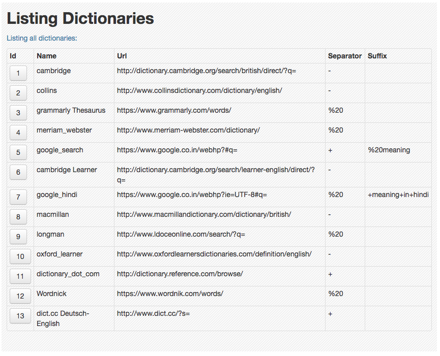

<!-- START doctoc generated TOC please keep comment here to allow auto update -->
<!-- DON'T EDIT THIS SECTION, INSTEAD RE-RUN doctoc TO UPDATE -->
**Table of Contents**  *generated with [DocToc](https://github.com/thlorenz/doctoc)*

- [Manage Words](#manage-words)
    - [Setup](#setup)
    - [How to use?](#how-to-use)

<!-- END doctoc generated TOC please keep comment here to allow auto update -->

# Manage Words

Picking up a new language is a fun. Using `manage-words` will make it cherry on the cake!

The app helps you in keeping track of vocabulary and pronunciation by providing random test based on various custom-defined filters and assigning comfort level depending on your performance.

## Setup

_**Pull the docker image:**_

```sh
docker pull goyalmunish/manage-words:latest
```

_**Build the docker image locally (if you are developing locally):**_

```sh
git clone git@github.com:goyalmunish/manage-words.git
cd manage-words
docker build -t goyalmunish/manage-words -f Dockerfile ./

# push the image (for repo owner)
docker push goyalmunish/manage-words:latest
```

_**Running the docker image:**_

```sh
# run image
docker run -it -d --name manage-words -e PS_START=de-$(uname -n) -e HOST_PLATFORM=$(uname -s) -p 3000:3000 goyalmunish/manage-words

# for testing out CMD, you might like to run the image as follows
docker run -it -d --name manage-words -e PS_START=de-$(uname -n) -e HOST_PLATFORM=$(uname -s) -p 3000:3000 goyalmunish/manage-words /bin/bash -c "ping -i 0.2 $(gateway_ip)"
```

_**Debugging:**_

```sh
# tail logs
docker logs -ft manage-words

# exec into the container
docker exec -it manage-words /bin/zsh
cd manage-words
```

## How to use?

This is how your word list would look like:

<p align="center">
  
</p>

which can be ordered and filtered using custom defined filters, such as below:

<p align="center">
  
</p>

_**Adjusting Comfort Levels:**_

During a test, once can upgrade or downgrade comfort level of that word in terms of meaning and pronunciation.

<p align="center">
  
</p>

You can define your own comfort level flags:

<p align="center">
  
</p>

_**Managing external dictionaries to get single click results:**_

Rather than searching google for meaning of the word you can configure the dictionary you like so that you get details of the word from external sites in a single click, such as following:

<p align="center">
  
</p>

_**Make use of backup files:**_

Moreover, you have option to take backup of data (along with progress) or to make use of someboday's else data by uploading it.

<p align="center">
  
</p>
